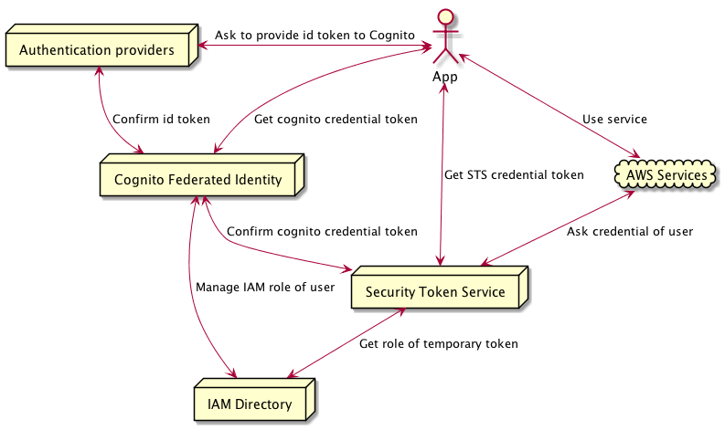
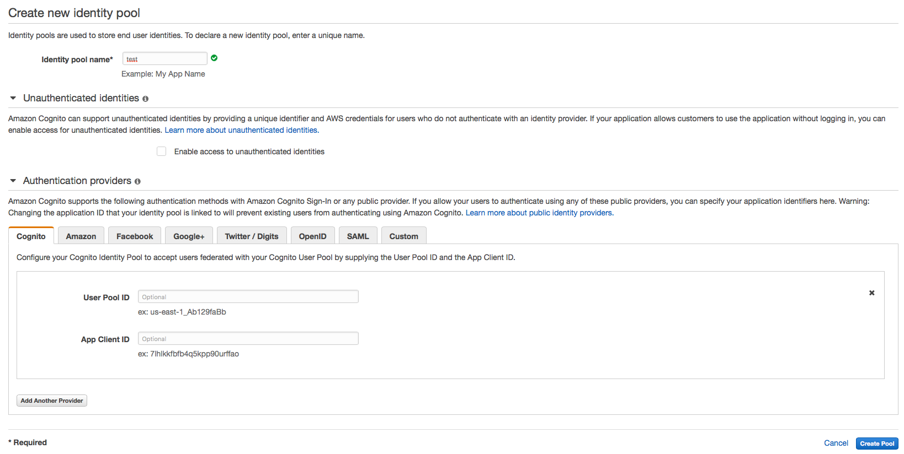
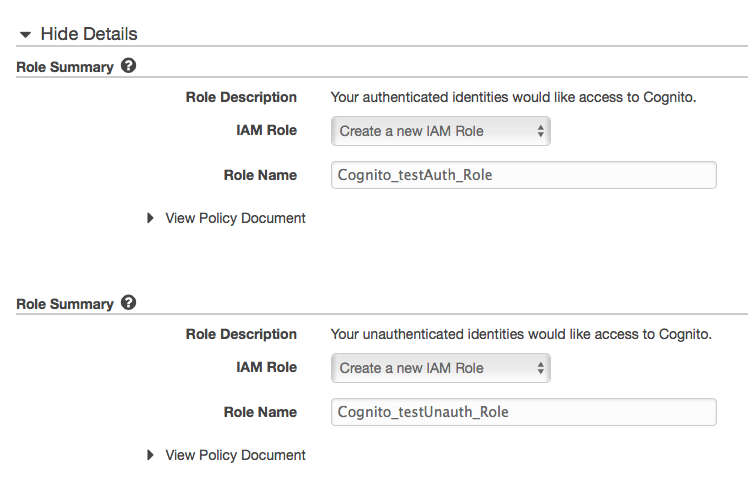

name: title
class: middle, center, inverse

# .title_upper[Introduction to Cognito]

.author[박진언 ([jinunpark@maverickgames.co](mailto:jinunpark@maverickgames.co))]
---
class: middle

## 발표자: 박진언

### 관심사
* 재미있는 게임 만들기
* 더 즐겁게 프로그래밍하기
* 가벼운 팀 만들기

### 경력
* Maverick Games 프로그래머
* (전) NCSoft B&S 개발실 서버 프로그래머
* (전) 루비콘게임즈 서버 프로그래머

---
class: middle

# 이야기할 것

- Cognito를 사용할 만한 문제 상황
- AWS Cognito의 Federated Identity 생성 및 관리방법
- Cognito를 이용해 어떤 사용자가 접근하는지 알기

???

# Cognito를 사용할 만한 문제 상황
- 왜?
- 구체적인 문제

# AWS Cognito의 Federated Identity 생성 및 관리방법
- 튜토리얼은 아님

# Cognito를 이용해 어떤 사용자가 접근하는지 알기
- 써 본 것들만 이야기한다

---
class: middle

# 이야기하지 않는 것

- Cognito User Pool
- Cognito의 Data Sync
- 서비스 연동 

???

# Cognito User Pool
- 써 본 적 없음
- Facebook 이외의 계정 연동은 하지 않기로 함(일단 필요 없으므로)
- Federated Identity로도 Cognito의 개념을 알기에는 충분

# Cognito의 Data Sync
- 현재 개발하는 서비스에는 필요하지 않아 조사하지 않았음

# 서비스 연동 
- 다른 서비스 계정 연동
- 커스텀 로그인 계정 연동

---
class: middle

# 문제 상황
- 유저의 게임 로그를 수집하고 싶다
- AWS의 EC2, Lambda 등에 접근할 때 유저 정보를 구분하고 싶다
- (페이스북 등의 계정으로) 유저 구분이 가능했으면 좋겠다
- 하지만 로그인하지 않은 유저도 구분할 수 있으면 좋겠다

---
class: middle

# 해결책

- 페이스북 로그인 : 익명 로그인이 필요해요
- 자체 인증 서버 만들기 : 바빠요

## -> Cognito를 쓰자!

???

# 페이스북 로그인 강제
- 페이스북 로그인 자체가 큰 허들
- 애플 앱스토어에 올리려면 익명 플레이 가능해야 함

# 인증 서버 만들기
- 처리해야 하는 일
  - 아이디 관리
  - 비밀번호 관리
  - 3rd party 로그인 관리
  - 세션 만들기
  - 세션이 끊어지려고 할 때 만료 처리
  - 세션 연장 처리
  - 타 서버의 세션 유효 질의 & 질의 처리
  - 유저 ban 처리
  - + 스케일링

# Cognito
- 익명 로그인이 가능하다
- 세션 처리 관련 기능이 구현되어 있다
- + 스케일링

---
class: middle

# Cognito란?

- 집단 Identity 관리 서비스

---
class: middle

## 집단?
- 열려 있고 (누가 들어올 지 알 수 없고)
- 언제 사용을 시작해서 언제 끝낼 지 알 수 없으며
- 어떤 행동을 할 지 알 수 없고
- 몇 명이 접근할 지 알 수 없음

## 제한점 
- 영구적인 권한을 부여할 수 없다

---
class: middle

# (그래서)Cognito란?

- 집단 Identity 관리 서비스
- Identity 별로 임시 권한을 발급해 준다

---
class: middle

## Cognito를 사용한 AWS Service 접근 구조


???

1. 유저가 앱 사용
1. Amazon 등의 identity provider에 로그인하고 id token 받음 (생략가능)
1. id token을 cognito token으로 교환
1. cognito token을 sts token으로 교환
1. sts token으로 aws service 이용

---
class: middle

## 약간 더 자세하지만 못생긴 버전



???

# 추가된 것
- 서버 간 확인 과정 추가

1. Auth Provider - Cognito간 확인
1. Cognito - STS 간 확인
1. STS - IAM 간 확인
1. AWS service - STS간 확인

---
class: middle

## 사용 방법 - Identity Pool 만들기(1)



???

- Federation Identity에서 생성
- 이름 입력
- Enable access to unauthenticated identities
  - unauthenticated identities?
    - Cognito의 identity는 기본적으로 unauthenticated
    - 만약 서비스에 연결한다면 authenticated가 됨
    - unauthenticated identity는 세션이 살아있는 동안 유지
  - 서비스를 연동하지 않으면 이 옵션을 켜야 함
- 연동할 서비스 선택
  - Facebook의 경우 개발자 사이트에서 app을 만들면 app id를 받을 수 있음
  - app id를 입력하면 끝

---
class: middle

## 사용 방법 - Identity Pool 만들기(2)



???

- IAM Role 설정
  - Authenticated와 Unauthenticated identity에 대한 role을 다르게 설정할 수 있음

---
class: middle

## 사용 방법 - 유니티에서 Credential 얻기
```csharp
    var _poolId = "ap-northeast-1:*******";
    var _region = RegionEndpoint.APNortheast1;

    _credentials = new CognitoAWSCredentials(_poolId, _region);
    _client = new AmazonKinesisClient(_credentials, _region);
```

- [AWS Signiture V4](http://docs.aws.amazon.com/AmazonS3/latest/API/sig-v4-authenticating-requests.html)를 사용해서 http를 통한 API 호출 가능

???

- AWS Unity SDK에 V4 서명 함수가 구현되어 있음
- 외부 인터페이스 없음 (내부 의존성 있음)
- (확실한 건 아니지만) 의존성을 제거하고 인터페이스를 뺄 거라는 문서를 읽은 적 있음
- 빨리 해주세요(....)

---
class: middle

## 사용 방법 - Service를 호출한 identity 알아내기

### API Gateway
- Request Body에 mapping template으로 추가할 수 있음

### Lambda
- Context Object를 통해 Id를 받을 수 있음
- 직접 Lambda를 호출할 때만 전달됨

### Kinesis
- 없음
- 만들어 주세요

---
class: middle

# 결론

- Cognito는 꽤 쓸만한 서비스

???

# 장점
- Scaling을 신경쓰지 않아도 된다
- 익명 로그인 개수도 신경쓰지 않아도 된다

# 단점
- Role이 두 가지 종류밖에 없음
- Identity Pool 내부에 구분이 하나 더 있었으면 좋겠다

---
class: middle

# Q & A

---
class: middle

## 참고자료

- [What is Amazon Cognito](http://docs.aws.amazon.com/cognito/latest/developerguide/what-is-amazon-cognito.html#first-time-user)
- [모바일 앱을 위한 Amazon Cognito 사용](http://docs.aws.amazon.com/ko_kr/IAM/latest/UserGuide/id_roles_providers_oidc_cognito.html)
- [Lambda context object](http://docs.aws.amazon.com/lambda/latest/dg/python-context-object.html)
- [API Gateway mapping template](http://docs.aws.amazon.com/apigateway/latest/developerguide/api-gateway-mapping-template-reference.html)

